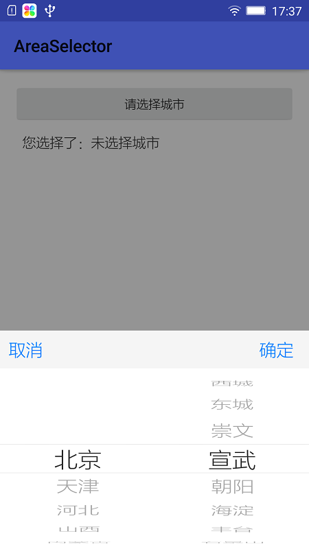
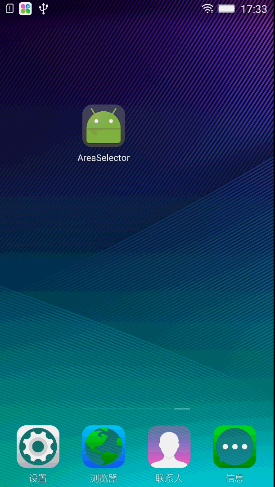

# AreaSelector
仿IOS的地区选择器，二级联动，也支持三级联动。选择器控件使用了开源项目：<https://github.com/saiwu-bigkoo/Android-PickerView/>，感谢这位童鞋的无私分享。该开源项目没有一份完整的地区信息，我从网上找了一份地区json数据，支持二级联动，如果需要三级联动，需要修改下json数据及修改数据bean。

# 使用

欢迎clone代码看看，源码面前，了无秘密。
(1)引用开源控件库，这里需要解析json数据，所以加入了gson库：  

	//PickerView
    compile 'com.bigkoo:pickerview:2.1.1'
    //goson
    compile 'com.squareup.retrofit2:converter-gson:2.1.0'
	
(2)查看MainActivity.class里面的initData()部分。

# 效果图

# 关于我
有任何使用问题，可以给我发邮件：

Author：张利峰

E-mail：519578280@qq.com

# License

    Copyright(c)2016 xyzlf Open Source Project
    
    Licensed under the Apache License, Version 2.0 (the "License");
    you may not use this file except in compliance with the License.
    You may obtain a copy of the License at
    
    http://www.apache.org/licenses/LICENSE-2.0
    
    Unless required by applicable law or agreed to in writing, software
    distributed under the License is distributed on an "AS IS" BASIS,
    WITHOUT WARRANTIES OR CONDITIONS OF ANY KIND, either express or implied.
    See the License for the specific language governing permissions and
    limitations under the License.
